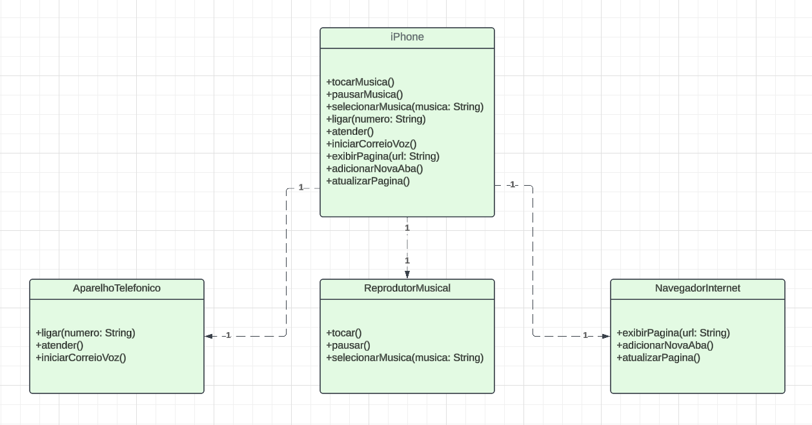

# Desafio POO - Modelagem e Diagramação do Componente iPhone

## Descrição
Este projeto foi desenvolvido como parte de um desafio de Programação Orientada a Objetos (POO), onde foi solicitado modelar e diagramar um **componente iPhone** com base em suas funcionalidades de **Reprodutor Musical**, **Aparelho Telefônico**, e **Navegador na Internet**. A modelagem segue as diretrizes de UML (Unified Modeling Language).

O objetivo é criar um diagrama UML que represente essas funcionalidades e, opcionalmente, implementar as classes em Java.

## Funcionalidades Modeladas

1. **Reprodutor Musical**
    - Métodos:
        - `tocar()`
        - `pausar()`
        - `selecionarMusica(String musica)`

2. **Aparelho Telefônico**
    - Métodos:
        - `ligar(String numero)`
        - `atender()`
        - `iniciarCorreioVoz()`

3. **Navegador na Internet**
    - Métodos:
        - `exibirPagina(String url)`
        - `adicionarNovaAba()`
        - `atualizarPagina()`

##  Diagrama UML

O diagrama UML abaixo apresenta as relações entre as interfaces e classes responsáveis por representar as funcionalidades do componente iPhone:

## Como Rodar o Projeto

### Pré-requisitos
- Java Development Kit (JDK) instalado (Java 8 ou superior).
- Um IDE para desenvolvimento como **IntelliJ IDEA** ou **Eclipse**.

### Passos
1. Clone este repositório em sua máquina.
2. Importe o projeto em sua IDE de escolha.
3. Compile e rode as classes Java (caso tenha implementado).
4. Opcional: Visualize o diagrama UML utilizando uma ferramenta de modelagem UML.

## Melhorias Futuras
- Implementar uma interface gráfica para simular as funcionalidades do iPhone.
- Expandir o projeto para incluir mais funcionalidades do iPhone, como envio de mensagens, câmera, e configurações.

## Autor
Este projeto foi desenvolvido por **Arthur Reis** como parte de um desafio de POO para melhorar as habilidades de modelagem e diagramação utilizando UML.
